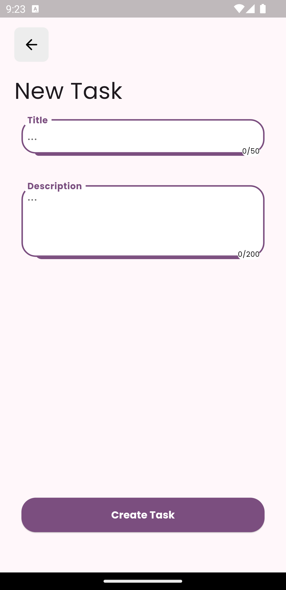
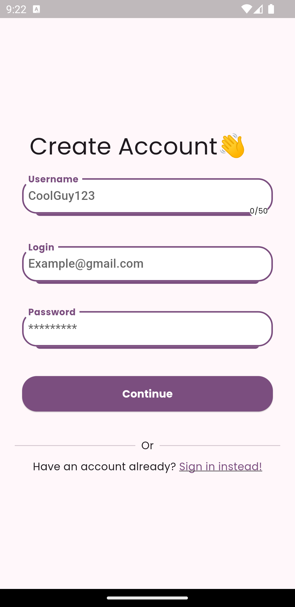

# To Do List App

Simple ToDo List [Flutter](https://flutter.dev) app integrated with Firebase.

## Quick peek

UI design is heavily inspired by [this UI design](https://dribbble.com/shots/23419236-Streamline-Mobile-App).

 

